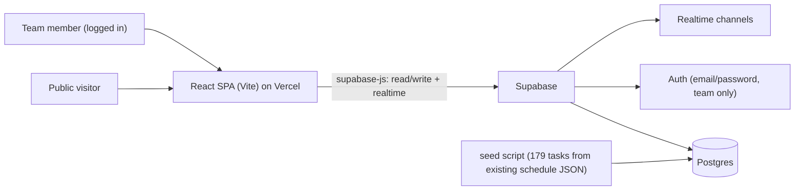

# Warm Wheelers Team Page — Design

Date: 2026-06-18
Status: Approved (design); pending implementation plan

## 1. Purpose

A single web app that is the source of truth for the Warm Wheelers gas-heater soapbox build, and doubles as a "build in public" showcase. It has two zones:

- Public showcase (open to everyone): bold Sunset Garage hero, live countdown to the event, milestones and overall progress, and a build-story teaser.
- Internal cockpit (team login): calm, warm, highly functional daily task tracker (the existing 179-task schedule), a decisions log, and notes — all persisted to a central store and synced in realtime so every team member sees the same state.

Security is deliberately light: everything is eventually public. The only real boundary is that writing data requires an authenticated team member.

## 2. Constraints and principles

- Simple to maintain code-wise; no bespoke backend server.
- Robust, well-implemented functional elements (the cockpit must be reliable).
- Artistic, unconventional visuals — must not look like a generic template/AI site.
- Motion is gentle ("wow without noise") and respects `prefers-reduced-motion`.

## 3. Tech stack

- Frontend: Vite + React + TypeScript, single-page app.
- Data/auth: Supabase (Postgres, Row Level Security, Realtime, Auth).
- Hosting: Vercel (SPA).
- Data access: `supabase-js` directly from the client (no custom API server).

## 4. Architecture



- Public reads are open via RLS `select` policies.
- Inserts/updates/deletes require an authenticated user (team).
- Realtime subscriptions keep the cockpit in sync across team members.

## 5. Data model (Supabase / Postgres)

- `phases`: `id`, `order_index`, `name` (e.g. "6. FEA Iteration").
- `days`: `date` (PK), `day_of_week`, `phase_id`, `focus`, `outcome`.
- `tasks`: `id` (e.g. "T001"), `day_date` (FK), `description`, `output`, `est_hours`, `deadline`, `priority` (P0|P1|P2|P3), `owner`, `dependencies`, `source`, `is_decision` (bool), `decision_question`, `status` (not_started|in_progress|done), `done_at`.
- `decisions`: `id`, `task_id` (FK), `question`, `answer`, `status` (open|resolved), `decided_by`, `decided_at`. Seeded from decision-flagged tasks (~47).
- `notes`: `id`, `task_id` (nullable, FK), `body`, `author`, `created_at`.
- `milestones`: `id`, `label`, `target_date`, `achieved` (bool) — drives the public rail.
- `settings` (singleton row): `event_name`, `event_date` (countdown target; currently TBD), `freeze_date`, public toggles.

Migration: a one-time seed script parses the schedule data currently embedded in `Vision/soapbox_daily_schedule_interactive.html` (13 phases, 75 day-cards spanning 18 Jun–31 Aug 2026, 179 tasks) and inserts phases, days, tasks, and derived decisions.

## 6. App structure

```
src/
  lib/supabase.ts        # client + typed queries
  store/                 # data hooks (useTasks, useDecisions, useNotes, useSettings) with realtime
  routes/
    public/              # Hero, Countdown, Milestones, StoryTeaser
    cockpit/             # Dashboard, TaskTracker, DecisionsLog, Notes
    auth/                # Login
  components/            # shared (badges, progress bars, cards, task row)
  theme/                 # design tokens
  styles/                # global CSS + keyframes (sunburst, flicker, ticker)
```

Routing:
- `/` — public showcase.
- `/build` — internal cockpit; redirects to `/login` when not authenticated.
- `/login` — team email/password.

## 7. Features (v1)

Internal cockpit:
- Task tracker: list by day/phase; toggle status (not started/in progress/done); filter and search by phase, priority, and decisions-only; "show today"; live metrics (total, completed, open decisions, progress %).
- Per-task notes and general team notes; realtime sync.
- Decisions log: all decision-flagged items with editable answer and open/resolved status.

Public showcase:
- Hero (Sunset Garage): rotating sunburst, gas-heater cart illustration with flickering grille panels, halftone texture.
- Live countdown to `settings.event_date`.
- Milestones rail + overall progress (derived from task completion and current phase).
- Build-story teaser (full feed deferred to phase 2).

Deferred to phase 2: documents hub, full timeline/Gantt visualisation, interactive cart build visualisation, public story feed, media gallery.

## 8. Visual system (locked: "Sunset Garage")

- Tokens: cream `#f1e0c2` / `#faf6ee`, rust `#c8471f`, mustard `#e2b773`, deep brown `#7a2a12`, ink `#2f2a23`.
- Type: serif display (Georgia-class) for headlines; clean sans for UI; monospace for countdown and figures.
- Public (bold): sunburst rotate, grille-panel flicker, ticking countdown, marching milestone ticker, halftone, CSS/SVG cart hero evolved from the existing `Vision/gas_heater_cart_side_cutaway_aero.svg`.
- Cockpit (calm): white panels on warm background, rust as a single accent plus mustard→rust progress gradient, generous whitespace, scannable rows.
- Accessibility: honor `prefers-reduced-motion`; maintain readable contrast.

## 9. Build phases

1. Scaffold: Vite + React + TS, styling tokens, Supabase project, base layout/theme.
2. Data layer: tables + RLS policies; seed script migrates 179 tasks + derived decisions.
3. Cockpit task tracker: realtime CRUD, filters/search/today, metrics, per-task notes.
4. Decisions log + general notes.
5. Auth: team email/password gating `/build`.
6. Public showcase: hero, countdown, milestones/progress, story teaser.
7. Polish: motion, responsive, reduced-motion, deploy to Vercel.

## 10. Open points

- Event date for the countdown is an unresolved P0 (task T002). Implement as an editable `settings.event_date` with a placeholder until confirmed.
- Team auth: a few email/password accounts created directly in Supabase is sufficient given lax security requirements.
- Styling tooling (Tailwind vs plain CSS with tokens) to be confirmed at scaffold time; either supports the locked visual system.
